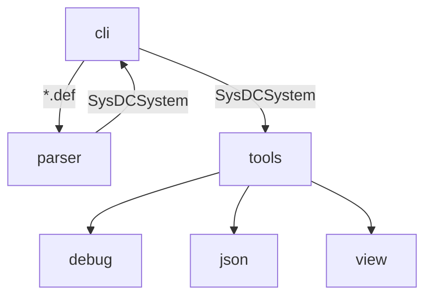

# SysDC

[](https://github.com/Yuta1004/SysDC/actions/workflows/check.yml)

## 概要

システム設計支援言語

## 構成

### src(cli) [bin]

CLI

### parser [lib]

プログラムを内部表現に変換する

### tools [lib]

内部表現を利用するツール群



## ビルド

```
$ make build
```

## サンプルコードの実行

### Box

```
$ ./sysdc parse example/box/*.def
Load: box.def
1 units loaded!

$ ./sysdc exec debug

$ ./sysdc exec json

$ ./sysdc exec view
```

## コマンド

### parse

指定されたファイルを読んで内部表現への変換を行う  
変換結果はMessagePack形式で出力される

#### 実行例

```
./sysdc parse example/compiler/*.def -o compiler.sysdc
```

#### 引数

- INPUT: ファイル名

#### オプション

- -o / --output : 出力ファイル名 (省略した場合は `out.sysdc`)

### exec

ツールを実行する

#### 実行例

```
./sysdc exec json -i compiler.sysdc --args compiler.json
```

#### 引数

- TOOL: 実行するツール名

#### オプション

- -a / --args : ツールに渡す引数
- -i / --input : 内部表現が保存されたファイル名 (省略した場合 `out.sysdc`)
