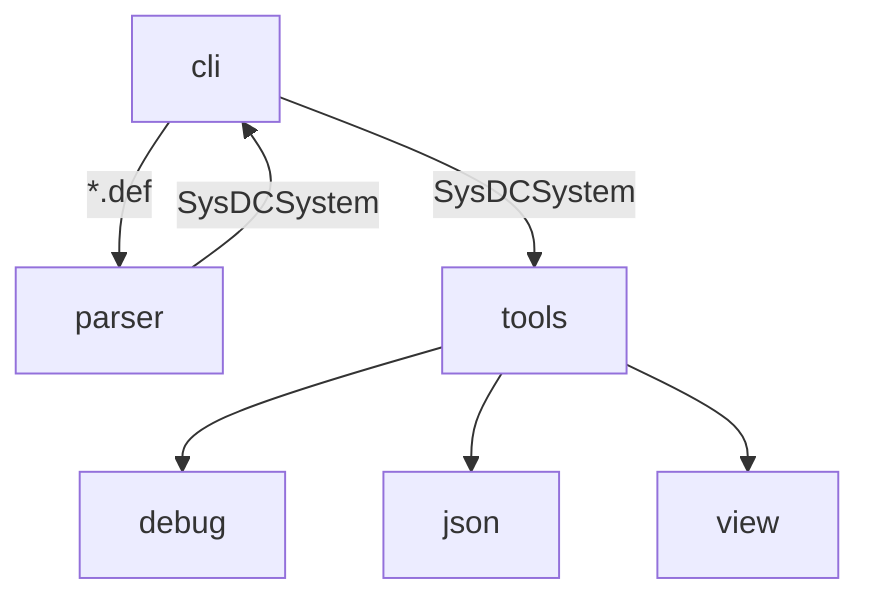

# SysDC

[](https://github.com/Yuta1004/SysDC/actions/workflows/check.yml)

## 概要

システム設計支援言語

## ビルド

```
$ make build
```

### 依存関係

- `cargo`
- `node`
- `npm`

<details>
<summary>確認済環境</summary>

```
$ cargo --version
cargo 1.63.0 (fd9c4297c 2022-07-01)

$ rustc --version
rustc 1.63.0 (4b91a6ea7 2022-08-08)

$ node --version
v18.9.0

$ npm --version
8.19.2
```

</details>

## サンプルコードの実行

### Box

```
$ ./sysdc parse example/box/*.def
Load: box.def
1 units loaded!

$ ./sysdc exec debug

$ ./sysdc exec json

$ ./sysdc exec view
```

## コマンド

### parse

指定されたファイルを読んで内部表現への変換を行う  
変換結果はMessagePack形式で出力される

#### 実行例

```
./sysdc parse example/compiler/*.def -o compiler.sysdc
```

#### 引数

- INPUT: ファイル名

#### オプション

- -o / --output : 出力ファイル名 (省略した場合は `out.sysdc`)

### exec

ツールを実行する

#### 実行例

```
./sysdc exec json -i compiler.sysdc
```

#### 引数

- TOOL: 実行するツール名

#### オプション

- -i / --input : 内部表現が保存されたファイル名 (省略した場合 `out.sysdc`)

## 構成

### src(cli) [bin]

CLI

### parser [lib]

プログラムを内部表現に変換する

### tools [lib]

内部表現を利用するツール群



## ライセンス

Apache License 2.0  
Copyright 2022 Yuta NAKAGAMI
