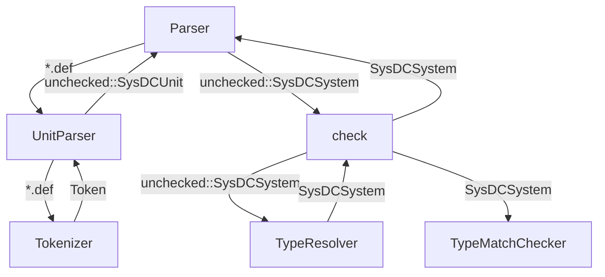
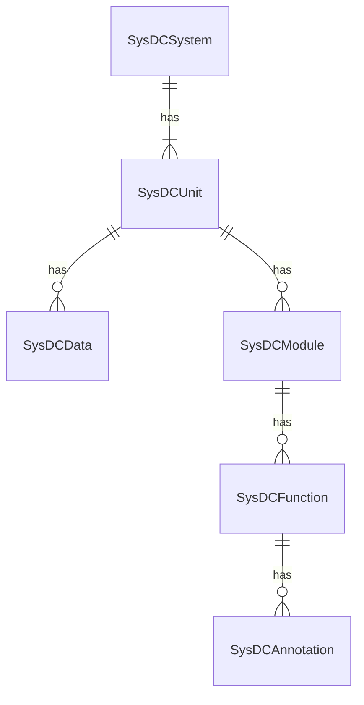

# SysDC-Core

## 概要

SysDCのパーサ

## コマンド

### WASMパッケージ生成

ビルド用イメージが必要です

```
$ make pkg
```

### ビルド用イメージ生成

```
$ make build-image
```

## 構成



### check.rs

型チェック周りの処理を記述

### error.rs

コンパイルエラーを扱う構造体，列挙体を定義

### lib.rs

ライブラリクレートとして公開するためのファイル  
以下の構造体・モジュールを公開する

- `struct Parser` (lib.rs)
- `mod structure` (structure.rs)
- `mod name` (name.rs)
- `mod types` (types.rs)

### location.rs

ソースコード上の位置を表すための構造体を定義

### name.rs

内部表現内で使用する名前を扱うための構造体を定義

### parse.rs

パース周りの処理を記述

### structure.rs

内部表現用の構造体・列挙体を定義  
ルートに定義されるものと `unchecked` モジュール内に定義されるものがある

### token.rs

トークナイズ周りの処理を記述

### types.rs

型を扱う構造体・列挙体を定義

## 内部表現



